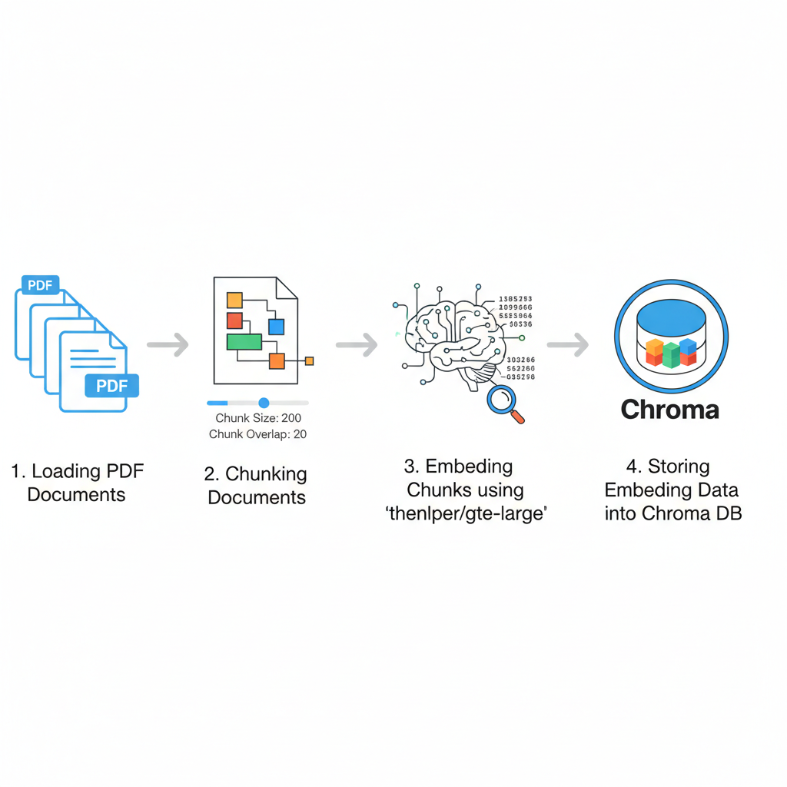

# TEKS Math AI Tutor – Grade 5

Application : <a href="https://tinyurl.com/Grade5MathTutor">Grade5MathTutor</a>

A **Retrieval-Augmented Generation (RAG)** based AI tutoring system built exclusively for  
**Grade 5 Mathematics**, aligned with the  
**Texas Essential Knowledge and Skills (TEKS)** curriculum.

📘 Curriculum Reference:  
<a href="https://tea.texas.gov/academics/curriculum-standards/teks/grade5-teks-062024-0.pdf" target="_blank" rel="noopener">
Reference (TEKS Grade 5 Math Curriculum – PDF)
</a>


This project uses **curriculum-grounded retrieval** to ensure accurate, grade-appropriate, and explainable math responses for students, parents, and teachers.

---

## 📖 Project Description

The **TEKS Math AI Tutor** is designed to answer Grade 5 mathematics questions using **only official TEKS curriculum content**.

### Key Capabilities

- Retrieves relevant TEKS standards from a **vector database**
- Uses a **Large Language Model (LLM)** with retrieved context
- Produces responses in a **strict JSON schema**
- Prevents hallucinations by disallowing non-curriculum knowledge

---

## 🧠 System Architecture

### 🔹 High-Level Flow

1. TEKS Grade 5 Math document ingestion  
2. Text cleaning and chunking  
3. Embedding generation  
4. Vector database creation  
5. Query-time retrieval (Top-K relevant chunks)  
6. Prompt + retrieved context sent to LLM  
7. Structured JSON response returned  

---

### 🔹 RAG Architecture Diagrams

#### 1️⃣ Loading Documents into Vector Database
Documents → Chunking → Embeddings → Vector DB




#### 2️⃣ User Interface → API → LLM
User Query → Retriever → Prompt + Context → LLM → JSON Response


---

## 📚 Knowledge Base

- **Texas Essential Knowledge and Skills (TEKS) – Grade 5 Mathematics**
- Curriculum text is chunked and embedded
- Each response references a relevant TEKS standard

### Scope Restriction
- Grade 5 Math only  
- No external knowledge  

---

## 📓 Jupyter Notebook Workflow

The  includes:

- TEKS document loading
- Text preprocessing and chunking
- Embedding creation
- Vector store initialization
- Prompt engineering
- RAG-based question answering tests

The notebook was used to validate the pipeline before Hugging Face deployment.

---

## 🧪 Sample Request & Response

### User Question
Prepare 15 problems on the topic Geometry and Measurement

### Model Response (Example)

```json
{
  "type": "Questions",
  "message": [
    {
      "Question": "What is the shape with four equal sides and four right angles?",
      "Answers": {
        "A": "Rectangle",
        "B": "Square",
        "C": "Triangle",
        "D": "Circle"
      },
      "CorrectOption": "B",
      "CorrectAnswer": "Square"
    }
  ]
}
```

---

## 📄 Response Schema

```json
{
    "type": "object",
    "additionalProperties": False,
    "required": ["type", "message"],
    "properties": {
      "type": {"type": "string", "enum": ["Concept", "Questions", "Refusal"]},
      "message": {
        "anyOf": [
          {"type": "string"},
          {
            "type": "array",
            "maxItems": 5, 
            "items": {
              "type": "object",
              "additionalProperties": False,
              "required": ["Question", "Answers", "CorrectOption", "CorrectAnswer"],
              "properties": {
                "Question": {"type": "string"},
                "Answers": {
                  "type": "object",
                  "additionalProperties": False,
                  "required": ["A", "B", "C", "D"],
                  "properties": {
                    "A": { "type": "string" },
                    "B": { "type": "string" },
                    "C": { "type": "string" },
                    "D": { "type": "string" }
                  }
                },
                "CorrectOption": {"type": "string", "enum": ["A", "B", "C", "D"]},
                "CorrectAnswer": {"type": "string"}
              }
            }
          }
        ]
      }
    }
  }

```

---
## ACCURACY / ANTI-HALLUCINATION RULES:
Do the math carefully. Ensure only one correct option unless the user explicitly asks for multiple correct answers.
If you detect ambiguity (missing numbers/units), ask ONE clarifying question using: {"type":"Concept","message":"I need one detail to answer: ..."} (Keep it math-only and kid-safe.)

STYLE GUIDELINES:
 - Use simple words and short sentences for kids.
 - For parents/teachers, add a brief note on how to support learning (1–2 sentences).
 - Avoid unrelated topics, brand names, or personal data requests.

---

## ☁️ Hugging Face Deployment

Backend is deployed on Hugging Face Spaces:

https://huggingface.co/spaces/TokenTutor/Grade5MathBackend

---

## ⚙️ Local Setup

```bash
git clone https://github.com/TechTrojan/TEKS-Math-AI-Tutor.git
cd TEKS-Math-AI-Tutor
pip install -r requirements.txt
export OPENAI_API_KEY="your_api_key"
```

Vector DB creation steps are provided in the Jupyter Notebook.

---

## 🎯 Use Cases

- Grade 5 student tutoring
- Teacher lesson planning
- Curriculum-aligned AI demos
- Educational RAG reference

---

## 🚀 Future Scope & Enhancements

This project is designed with extensibility in mind. The following enhancements outline the planned roadmap to evolve the TEKS Math AI Tutor into a scalable, multi-grade educational platform.

---

### 🔮 Functional Enhancements

- **User Authentication & Activity Tracking**  
  Introduce secure user authentication (e.g., OAuth or token-based login) to identify users uniquely and maintain session-level context.  
  This will enable:
  - User-specific interaction history
  - Learning progress tracking
  - Personalized tutoring experiences

- **Multi-Grade & Multi-Subject Expansion**  
  Extend the current Grade 5 Math–only scope to support:
  - Additional grades (Grades 1–12)
  - Multiple subjects (Science, English, Social Studies, etc.)  
  Each grade and subject will have isolated curriculum ingestion and retrieval pipelines to preserve accuracy.

- **Enhanced User Interface (UI/UX)**  
  Develop a richer and more interactive frontend with:
  - Chat-based tutoring interface
  - Visual explanations (charts, diagrams)
  - Improved accessibility and mobile responsiveness

- **User Subscription & Interest-Based Notifications**  
  Implement a subscription module allowing users to:
  - Select preferred grades and subjects
  - Subscribe to specific topics or skill areas  

  The system will periodically generate and send **relevant practice questions, quizzes, or learning tips** to users via email based on their preferences.

---

## ⚙️ Technical Enhancements

### 🔹 Retrieval Quality Dependence  Add structured logging across the system, including:
  - The quality of generated answers is **highly dependent on the retriever**.
  - If relevant curriculum chunks are not retrieved (due to embedding similarity errors or suboptimal chunking), the LLM may produce:
  - Incomplete explanations
  - Overly generic responses
- There is no secondary validation or reranking mechanism in place.

---

### 🔹 Limited Context Window

- Only a **fixed number of top-K retrieved chunks** are passed to the LLM.
- Important curriculum details may be omitted if they fall outside the retrieved context.
- This can impact answers for:
  - Multi-step problems
  - Broad or cross-topic questions

### 🔹 Limited Personalization

- The current architecture does not maintain:
  - User memory
  - Learning history
  - Skill progression
- All users receive the same responses for identical queries, regardless of prior interactions.

---

### 🔹 No Answer Verification Layer

- Generated responses are not validated against:
  - Rule-based checks
  - Mathematical solvers
  - Ground-truth answer keys
- Although curriculum grounding reduces hallucinations, **absolute correctness is not guaranteed**.

---


- **Scalable Knowledge Management in Vector Database**  
  Enhance the vector database design to:
  - Store embeddings segmented by **grade, subject, and curriculum**
  - Dynamically load and query the appropriate knowledge base at runtime
  - Support efficient scaling as new curricula are added  

  This modular approach will enable seamless expansion without impacting existing grade-level accuracy.

---

These enhancements aim to transform the project from a single-grade RAG demo into a **full-scale, curriculum-aware AI tutoring platform** suitable for real-world educational deployment.


## 🙌 Contributors

Thanks to the following people for their valuable contributions to this project:

- **<a href="https://github.com/ShivaniZ321">Shivani Zala</a>** – User Interface design
- **Leena Zala** – Testing 


## ⚠️ Disclaimer

This project is designed and developed **solely for learning, research, and experimental purposes**.

- The implementation is intended to demonstrate concepts such as **Retrieval-Augmented Generation (RAG)**, curriculum grounding, and AI-based tutoring.
- It is **not intended for commercial use, production deployment, or monetization**.
- The authors make no guarantees regarding accuracy, completeness, or fitness for any commercial or real-world educational deployment.
- Any use of this project beyond educational or experimental contexts is at the user’s own risk.

All curriculum content referenced remains the property of their respective owners, and this project is **not affiliated with or endorsed by the Texas Education Agency (TEA)**.

---


